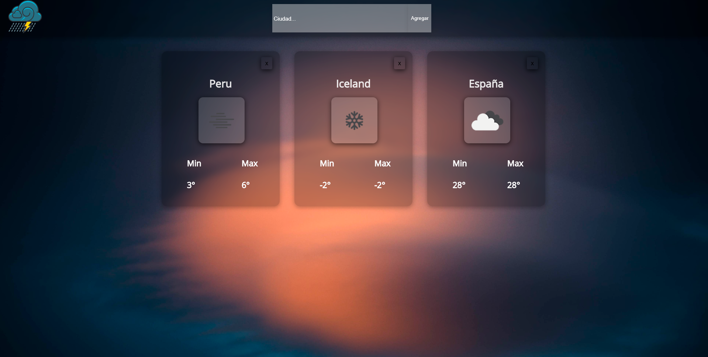

# Wheater-App

Proyecto pequeño que formo parte  del bootcamp de [Henry](https://www.soyhenry.com/).
Se utiliza una api para poder acceder a diferente informacion de la gran mayoria de paises existentes.
Y poder mostrar su temperatura actual , junto con una imagen que  depende del tipo de clima y si es de dia o de noche en dicha ciudad.

# Preview 
     
Link a la app: https://wheater-app-pi.vercel.app/                                                         
                                                                          
# Instalacion 
```
-clonar este repositorio
 https://github.com/gerlini/Wheater-App.git 
-npm install
-npm start
 ```                           
